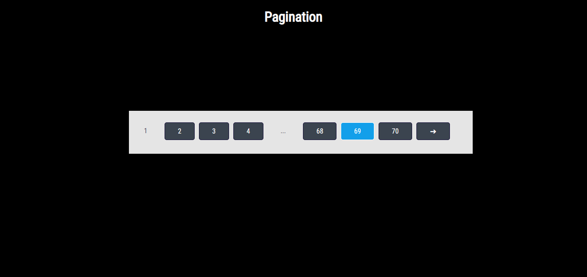

# Pagination

Réalisation de pagination de la formation Web dév chez @becodeorg.

## Voir le projet

Vous pouvez visualiser la page web via cette url [Pagination]()

## Librairie / Toolkit

* [Google Fonts](https://fonts.google.com/) - Fonts (Roboto Condensed, sans-serif)

## Auteurs
* **evrardsibo** _alias_ [@evrardsibo](https://github.com/evrardsibo)

